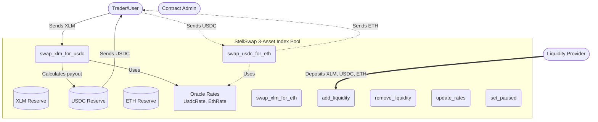
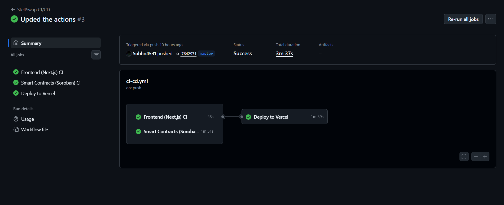
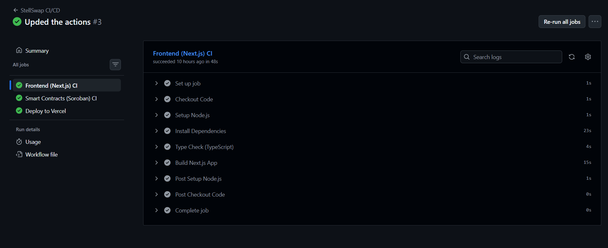
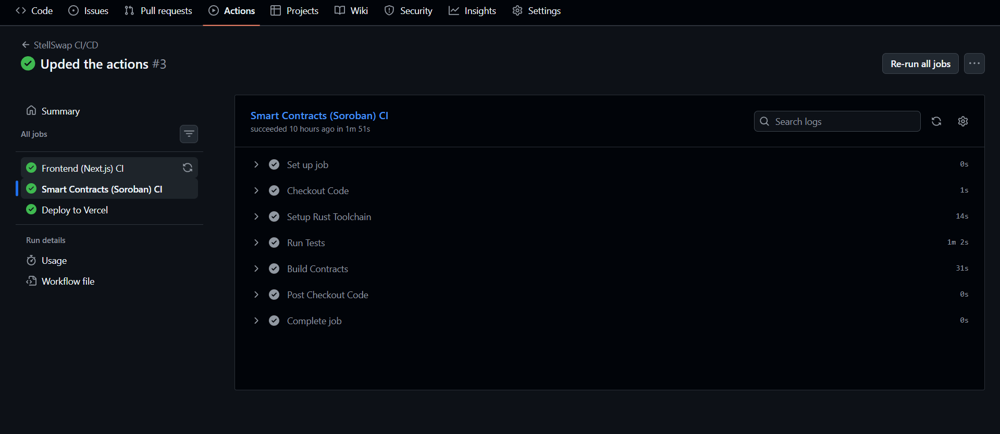
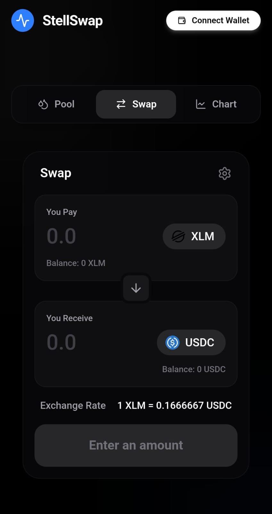
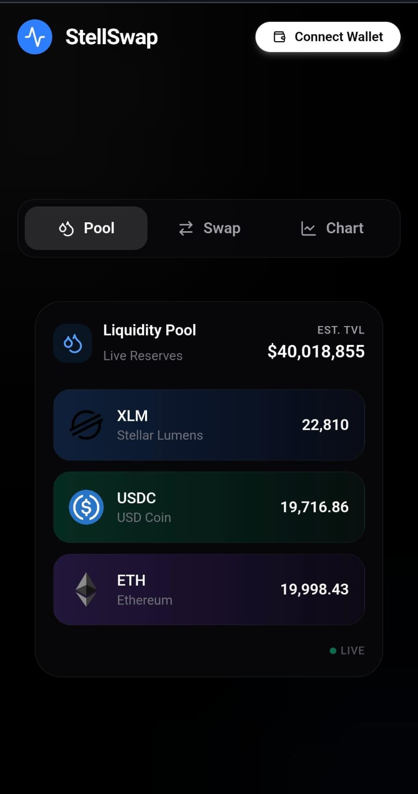
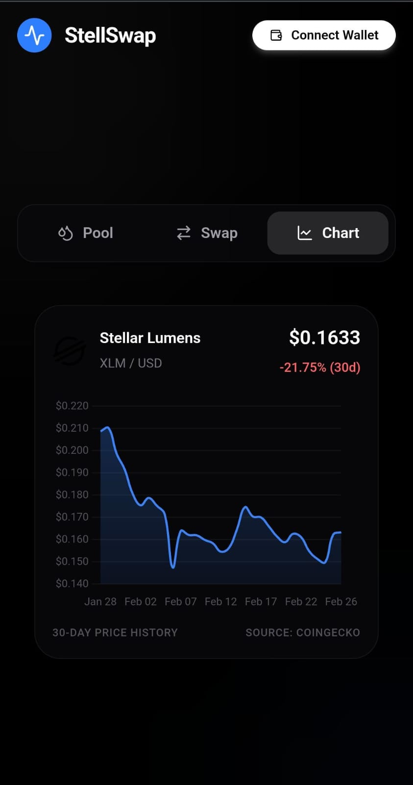
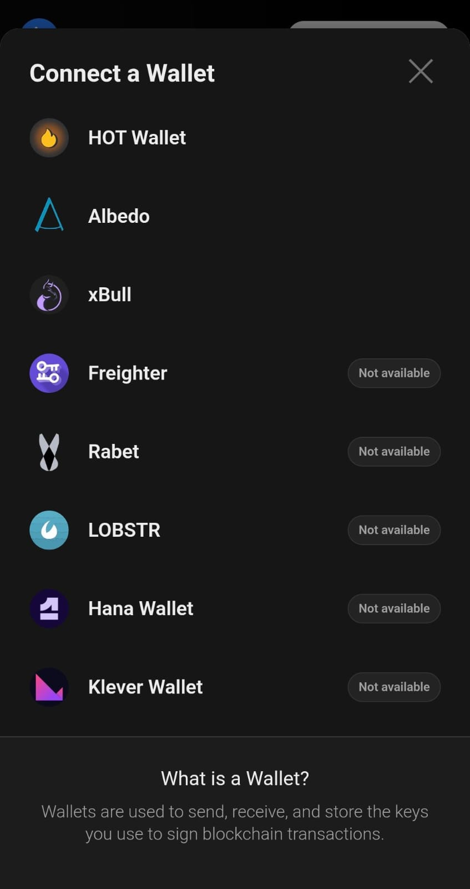

# StellSwap 🌌 — Smart, Efficient & Truly Decentralized

>A next-generation decentralized exchange (DEX) built on Stellar’s Soroban smart contracts, designed for capital efficiency, seamless trading, and a smooth user experience.

**The project is engineered for performance and clarity, featuring:**

- 🌊 Capital-Efficient Index Pools
- 🔄 Zero-Hop Cross-Pair Routing
- 👛 Multi-Wallet Support
- 📊 Live Market Data & Real-Time Charts
- ⚡ Fast, Low-Cost Transactions powered by Stellar

## 🎯 Stellar Journey to Mastery 

**Production-hardened DeFi application with a multi-asset AMM pool, efficient zero-hop gas routing, and live Multiple wallets integration.**

## 🏛️ Architecture Overview

```text
┌──────────────────────────────────────────────────────────────┐
│                       FRONTEND (Next.js + React)             │
│  ┌──────────┐ ┌──────────────┐ ┌───────────┐ ┌───────────┐  │
│  │ Wallet   │ │ Swap         │ │ Live Chart│ │ Token     │  │
│  │ Selector │ │ Interface    │ │ Component │ │ Modal     │  │
│  └────┬─────┘ └──────┬───────┘ └─────┬─────┘ └─────┬─────┘  │
│       │              │               │              │        │
│       └──────────────┴───────────────┴──────────────┘        │
│                              │                               │
│              ┌───────────────┴────────────────┐              │
│              │    Stellar SDK (sorobanRpc)    │              │
│              └───────────────┬────────────────┘              │
└──────────────────────────────┼───────────────────────────────┘
                               │ ← Soroban RPC
┌──────────────────────────────┼───────────────────────────────┐
│                    SMART CONTRACTS (Soroban)                 │
│  ┌─────────────────────┐     ┌──────────────────────┐        │
│  │ 3-Asset Index Pool  │────►│  External Tokens     │        │
│  │ • swap_xlm_for_usdc │     │  • XLM SAC Token     │        │
│  │ • swap_usdc_for_eth │────►│  • USDC Testnet      │        │
│  │ • add_liquidity     │     │  • ETH Testnet       │        │
│  │ • quote_usdc_to_xlm │     │                      │        │
│  └─────────────────────┘     └──────────────────────┘        │
│                                                              │
│  Zero-Hop Routing: USDC -> ETH internally priced via XLM     │
└──────────────────────────────────────────────────────────────┘
```


---

## ✅ Submission

### Required Documentation

#### Live Demo Link
🎥 **Demo Video:** [Watch on Google Drive](https://drive.google.com/file/d/1Yk6JfqIPkX094TidJyluMG4PdPr_tNcJ/view?usp=drivesdk)

#### Contract Addresses & Transaction Hash

**StellSwap AMM Liquidity Pool Contract ID:**
```
CCH3WGMUTBXK573BPC6MSWLQQZ72DYYOQ7ZFEOXJBJROFCTVFCETDQZA
```
[🔍 Verify on Stellar Expert Explorer](https://stellar.expert/explorer/testnet/contract/CCH3WGMUTBXK573BPC6MSWLQQZ72DYYOQ7ZFEOXJBJROFCTVFCETDQZA)

**Token Contracts:**
- **XLM SAC Token:** `CDLZFC3SYJYDZT7K67VZ75HPJVIEUVNIXF47ZG2FB2RMQQVU2HHGCYSC`
- **USDC Token:** `CBAFDW2AC2PSW3MGW5FVZUJSASEHMT7U6HX24XKHQ34GXXFKCGUX2I7Y`
- **ETH Token:** `CANGUK3UOKPZOKHTYUYOXJYJRQ5B7YH7ZSKXW6KNCIPOKXXUDNT3RT2V`

**Example Transaction Hash (Successful Swap Call):**
```
042cab10f52f02a74e361482362ab8ea003f5ce624c965e6b4e073040bc1d0a5
```
*(Swapped 10 XLM for 1.66 USDC)*
[🔍 View Transaction on Stellar Expert Explorer](https://stellar.expert/explorer/testnet/tx/042cab10f52f02a74e361482362ab8ea003f5ce624c965e6b4e073040bc1d0a5)

---

## 📸 Required Screenshots

### Application Interface

*Sleek, dark-mode terminal swap UI with live charts*

### Supported Wallets

*Freighter Wallet extension support via stellar-wallets-kit*

### Token Menu

*Token selection modal*

### Smart Contract Verification

*AMM Smart Contract functions verified*

### Contract Tests Passing

*31/31 Rust Smart Contract tests passing.*

### Transaction Success Flow


### Live Validation Check


### CI/CD Pipeline Integration with Github Actions




### 📱 Mobile Responsive UI

<p align="center">
  
  
  
  
</p>


---

## ✨ Features

### Core Features
- **Live Market Data** — Displays live XLM/USD pricing data using a dynamic Chart.js chart and `get_reserves` data from the contract.
- **Contract Called from Frontend** — The UI directly interacts with the Soroban contract for quotes (`get_rates`) and actual swaps.
- **Transaction Status Visible** — Real-time toast notifications guide the user through signing, submission, and confirmation.
- **Error Handling** — Deep error handling for rejected signatures, insufficient balances, and disconnected wallets.

### Smart Contract Architecture Upgrades 🆕
- **🏛️ 3-Asset Index Pool** — All three assets (XLM, USDC, ETH) reside within a single liquidity pool, maximizing capital efficiency for LPs.
- **⚡ Double Gas Savings (Zero-Hop Routing)** — To swap USDC for ETH, you don't need a factory router contract to bridge two separate token pools. The `swap_usdc_for_eth` function internally prices USDC to XLM, then XLM to ETH natively in a single update, **saving double the gas** and mitigating multi-hop slippage!
- **🛡️ Oracle Safety** — Admin-controlled oracle rates (`UsdcRate`, `EthRate`) peg cross-asset valuations to XLM to prevent extreme price manipulation attacks often seen in standard `x*y=k` AMMs with low TVL.
- **⛽ Internal State Ledger** — To prevent donation attacks and flash-loan exploits, the pool tracks true liquidity strictly through its persistent `DataKey::Reserve` states rather than easily-manipulated raw token balances.

---

## 🚀 Quick Start

### Prerequisites
- Node.js v18+
- npm
- Freighter Wallet browser extension
- Testnet XLM ([Get free XLM](https://laboratory.stellar.org/#account-creator?network=test))

### 1. Clone & Install

```bash
git clone <your-repo-url>
cd stellswap

# Install frontend UI dependencies
npm install
```

### 2. Configure Environment

Create a `.env` file in the root directory:

```env
NEXT_PUBLIC_CONTRACT_ADDRESS=CCH3WGMUTBXK573BPC6MSWLQQZ72DYYOQ7ZFEOXJBJROFCTVFCETDQZA
NEXT_PUBLIC_ADMIN_PUBKEY=GBV2VSXKD6CY3XNZOVKIWAEXBHYU3XDQWOGOZSFI27SDCA6SGST73ZBQ
NEXT_PUBLIC_USDC_TOKEN_ID=CBAFDW2AC2PSW3MGW5FVZUJSASEHMT7U6HX24XKHQ34GXXFKCGUX2I7Y
NEXT_PUBLIC_ETH_TOKEN_ID=CANGUK3UOKPZOKHTYUYOXJYJRQ5B7YH7ZSKXW6KNCIPOKXXUDNT3RT2V
```

### 3. Start Development

```bash
npm run dev
```

- Open [http://localhost:3000](http://localhost:3000) in your browser. Connect Freighter wallet (set to **Testnet**) to begin viewing balances, executing swaps, and watching quotes update.

---

## 🔗 Smart Contracts

### 3-Asset AMM Contract

Located in `contracts/hello-world/src/lib.rs`

| Function | Description |
|---|---|
| `swap_xlm_for_usdc` / `swap_xlm_for_eth` | Core swaps directly against the native reserve token |
| `swap_usdc_for_eth` / `swap_eth_for_usdc` | The unified cross-pair routing methods that save double gas |
| `add_liquidity` / `remove_liquidity` | Access points for adding/removing liquidity to the index pool |
| `quote_xlm_to_usdc` / `quote_usdc_to_xlm` | Instant on-chain expected yield mathematical quotes |
| `update_rates` | Admin-only pricing oracle adjustments |

**Zero-Hop Routing Flow (e.g., USDC for ETH):**
```
User calls swap_usdc_for_eth() on Stellswap Contract
  → Calculates intermediate XLM value (USDC * usdc_rate)
  → Calculates final ETH value (intermediate_xlm / eth_rate)
  → Contract transfers USDC from User to Pool
  → Contract transfers ETH from Pool to User
  → Updates Internal State Ledgers seamlessly
  → Emits SWAP event
```

### Build & Deploy Contracts

```bash
cd contracts/hello-world
cargo build --target wasm32-unknown-unknown --release

# Deploy (Stellar CLI required)
stellar contract deploy \
  --wasm target/wasm32-unknown-unknown/release/hello_world.wasm \
  --source YOUR_SECRET_KEY \
  --network testnet
```

---

## 🧪 Testing

### Smart Contract Tests (31 Passing ✅)
```bash
cd contracts/hello-world && cargo test
```

- Cross-pair zero-hop swaps accuracy (`test_swap_usdc_for_eth_cross_pair`)
- Slippage protection & minimum output checks (`test_slippage_usdc_for_xlm_panics`)
- Empty reserve panic protections (`test_swap_fails_on_empty_usdc_reserve`)
- Liquidity share math and proportion tests (`test_two_providers_lp_balances`)
- Pause controls and Admin Auth limitations

---

## 🔐 Security Features

### Smart Contract Level
- ✅ Internal state ledgers to prevent "donation" token-balance manipulation
- ✅ Admin-only oracle pricing to prevent algorithmic flash loan attacks
- ✅ Minimum output slippage guarantees on every swap function
- ✅ Strict zero-amount and disconnected auth validations
- ✅ Pause-state emergency breakers

### Frontend Level
- ✅ Simulated fee calculations via Soroban RPC
- ✅ Disconnected state handling & button protections
- ✅ Transaction rejection error catching via `unsignedXdr`

---

## 📄 License

MIT License — feel free to use this project as a learning resource!

---

## 🙏 Acknowledgments

Built for **Stellar Soroban Smart Contract Development Level 4.**

Special thanks to the Stellar Development Foundation for providing excellent documentation and tools.

---

**Submission Date:** February 2026
**Status:** Ready 
