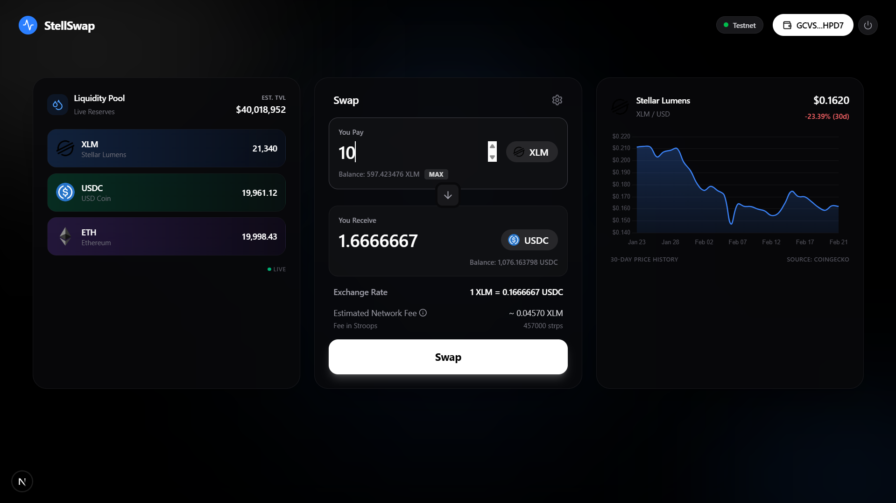
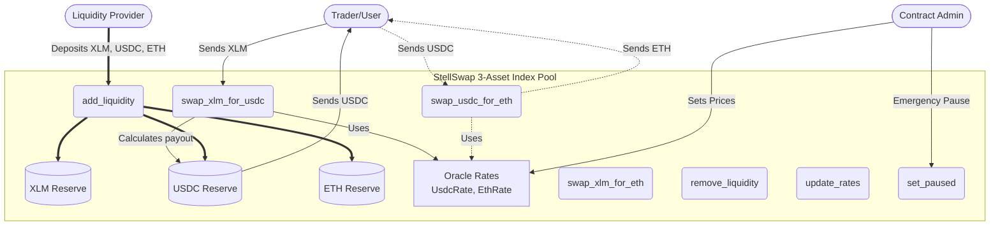
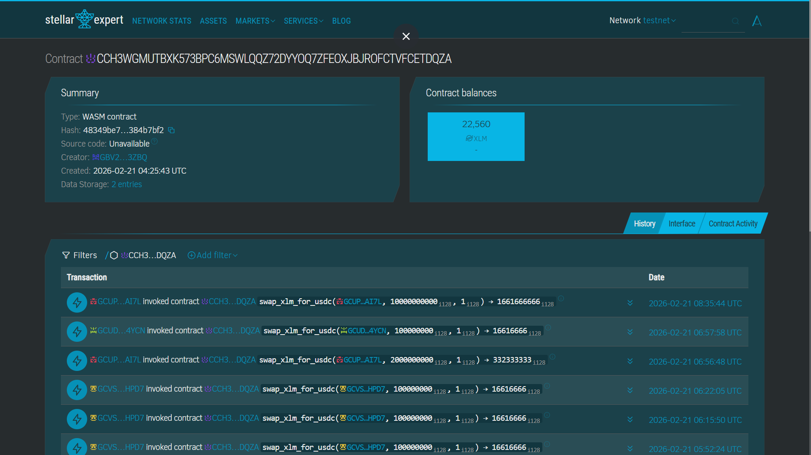
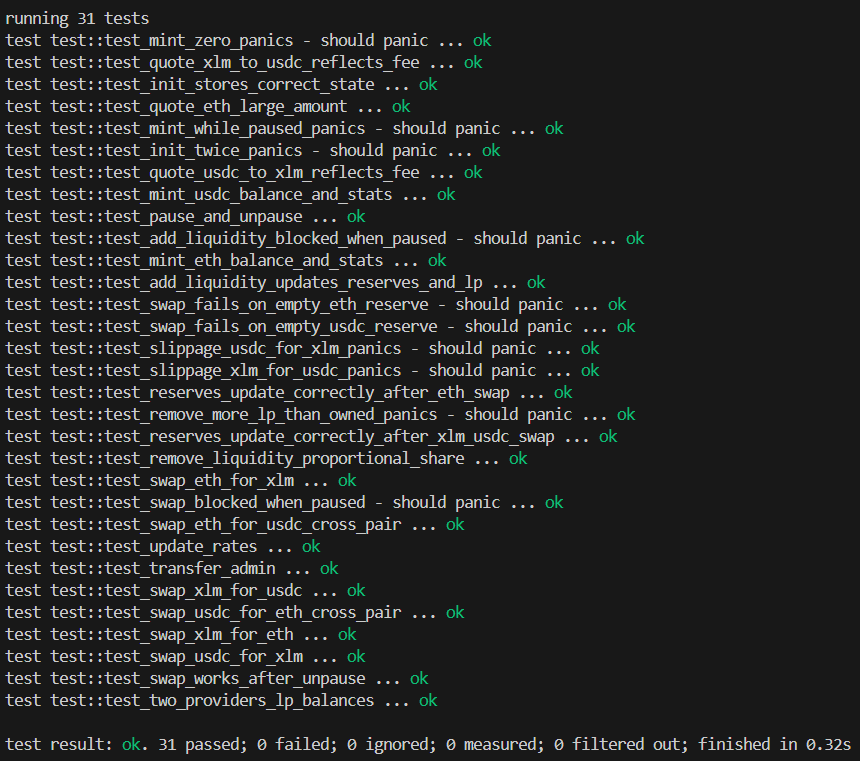
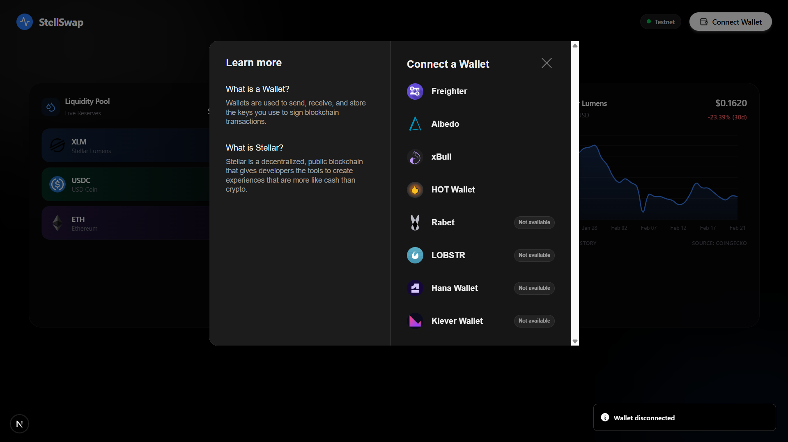
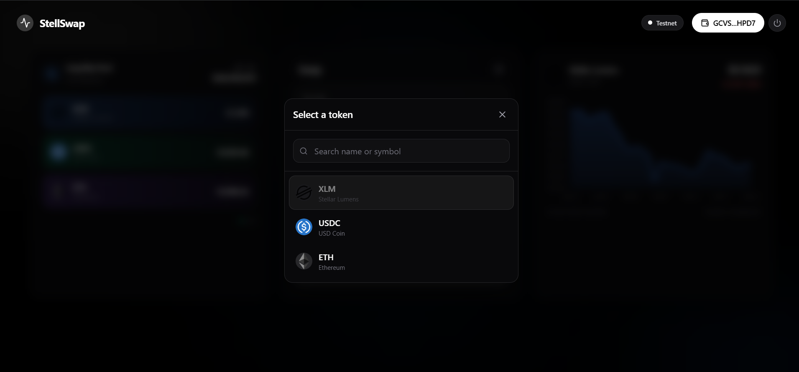
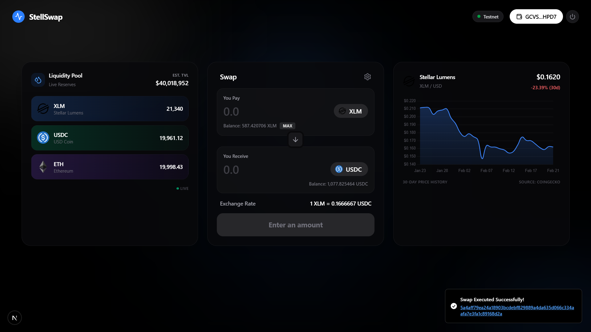
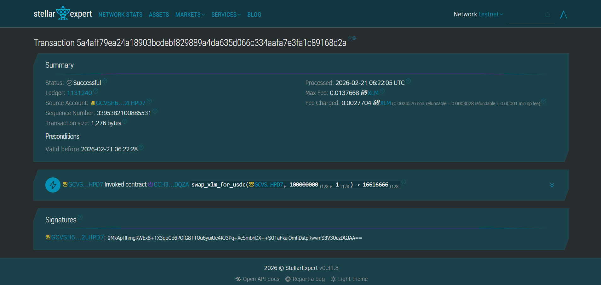

# StellSwap 🌌

StellSwap is a multi-wallet decentralized exchange (DEX) frontend built on the **Stellar Soroban Testnet**. It allows users to swap between XLM, USDC, and ETH using a real automated market maker (AMM) smart contract.



## 🚀 Features & Project Requirements Met

#### **Multi-Wallet Support:** Users can connect using the Freighter Wallet extension via `@creit.tech/stellar-wallets-kit`.
#### **Contract Deployed on Testnet:** The Soroban AMM contract is deployed live on the Stellar Testnet.
#### **Contract Called from Frontend:** The UI directly interacts with the Soroban contract for quotes (`get_rates`) and actual swaps (`swap_xlm_for_usdc`, etc.).
#### **Transaction Status Visible:** Real-time toast notifications guide the user through signing, submission, and confirmation (with polling for `SUCCESS`).
#### **Live Market Data:** Displays live XLM/USD pricing data using a dynamic Chart.js chart and `get_reserves` data from the contract for pool liquidity TVL.

### 🛡️ 3 Error Types Handled
1. **Wallet Not Connected:** Swap buttons and inputs are disabled; the UI prompts the user to "Connect Wallet" before attempting any transaction.
2. **Insufficient Balance:** The UI instantly checks user balances from the Soroban token contracts and disables the swap button with an "Insufficient Balance" warning if the entered amount exceeds their holdings.
3. **Transaction Canceled / Rejected:** If the user rejects the transaction signature in the Freighter wallet popup, the frontend catches the error and displays a clear "Transaction was canceled" warning toast instead of crashing.

---

## 🏛️ Smart Contract Architecture: The 3-Asset Index Pool

Unlike traditional `x * y = k` Automated Market Makers (AMMs) that require separate isolated pairs (e.g., an XLM/USDC pool and a separate XLM/ETH pool), StellSwap implements a **3-Asset Index Pool**. All three assets (XLM, USDC, ETH) reside within a single liquidity pool. 

### ⚡ Why this design? (Advantages & Gas Savings)

1.  **Capital Efficiency for LPs:** 
    Liquidity Providers do not fragment their capital across multiple pair contracts. By calling `add_liquidity`, they provide to the entire ecosystem at once and earn fees on *all* trades across the protocol.
    
2.  **Double Gas Savings (Zero-Hop Cross-Pair Swaps):** 
    To swap USDC for ETH, you don't need a factory router contract to bridge two separate token pools. The `swap_usdc_for_eth` function internally prices USDC to XLM, then XLM to ETH, providing a direct swap in a single transaction. 
    > In a traditional AMM, moving from USDC to ETH requires 2 hops (USDC -> XLM, then XLM -> ETH), requiring two separate contract invocations which doubles the transaction fee. StellSwap calculates this natively in a single internal update, **saving double the gas** and mitigating multi-hop slippage!
    
3.  **Admin-Controlled Oracle Pricing:** 
    The prices of USDC and ETH are initially pegged to XLM via the `update_rates` function, protecting the pool from the extreme price manipulation attacks often seen in pure constant-product AMMs with low initial TVL.

### 🔧 Featured Contract Functions

The contract exposes clean, efficient endpoints, perfectly formatted for the frontend implementation:

-   `swap_xlm_for_usdc` / `swap_xlm_for_eth`: Core swaps directly against the native reserve token.
-   `swap_usdc_for_eth` / `swap_eth_for_usdc`: The unified cross-pair routing methods that save double gas.
-   `add_liquidity` / `remove_liquidity`: Generalized access points for Market Makers to add or remove liquidity from the global multi-asset index pool.
-   `quote_xlm_to_usdc` / `quote_usdc_to_xlm`: Instant, on-chain mathematical quote functions that provide the frontend with exact expected yield calculations.

### Architecture Flow



---

## 🔗 Important Links & Contract Information

- **Contract Address:** `CCH3WGMUTBXK573BPC6MSWLQQZ72DYYOQ7ZFEOXJBJROFCTVFCETDQZA` (Stellar Testnet)
- **XLM SAC Token:** `CDLZFC3SYJYDZT7K67VZ75HPJVIEUVNIXF47ZG2FB2RMQQVU2HHGCYSC`
- **USDC Token:** `CBAFDW2AC2PSW3MGW5FVZUJSASEHMT7U6HX24XKHQ34GXXFKCGUX2I7Y` 
- **ETH Token:** `CANGUK3UOKPZOKHTYUYOXJYJRQ5B7YH7ZSKXW6KNCIPOKXXUDNT3RT2V`

**Testnet Transaction Hash (Successful Swap Call):**
`042cab10f52f02a74e361482362ab8ea003f5ce624c965e6b4e073040bc1d0a5`
*(Swapped 10 XLM for 1.66 USDC)*
[View on Stellar Expert Explorer](https://stellar.expert/explorer/testnet/tx/042cab10f52f02a74e361482362ab8ea003f5ce624c965e6b4e073040bc1d0a5)

---
## 📸 Screenshots









## 🛠️ Setup Instructions

To run this project locally, you will need **Node.js 18+** and the **Freighter Wallet extension** installed in your browser.

1. **Clone the repository:**
   ```bash
   git clone <your-repo-url>
   cd stellswap
   ```

2. **Install dependencies:**
   ```bash
   npm install
   ```
   *(Note: This installs Next.js, Stellar SDK, chart.js, and other required packages).*

3. **Configure Environment Variables:**
   A `.env` file should be present in the root directory with the following configuration:
   ```env
   NEXT_PUBLIC_CONTRACT_ADDRESS=CCH3WGMUTBXK573BPC6MSWLQQZ72DYYOQ7ZFEOXJBJROFCTVFCETDQZA
   NEXT_PUBLIC_ADMIN_PUBKEY=GBV2VSXKD6CY3XNZOVKIWAEXBHYU3XDQWOGOZSFI27SDCA6SGST73ZBQ
   NEXT_PUBLIC_USDC_TOKEN_ID=CBAFDW2AC2PSW3MGW5FVZUJSASEHMT7U6HX24XKHQ34GXXFKCGUX2I7Y
   NEXT_PUBLIC_ETH_TOKEN_ID=CANGUK3UOKPZOKHTYUYOXJYJRQ5B7YH7ZSKXW6KNCIPOKXXUDNT3RT2V
   ```

4. **Start the development server:**
   ```bash
   npm run dev
   ```

5. **Open the App:**
   Open [http://localhost:3000](http://localhost:3000) in your browser. Connect your Freighter wallet (ensure it is set to **Testnet**) to begin viewing balances, live market charts, and executing swaps.

---


---
Built for Stellar Soroban Smart Contract Development Level 2.
